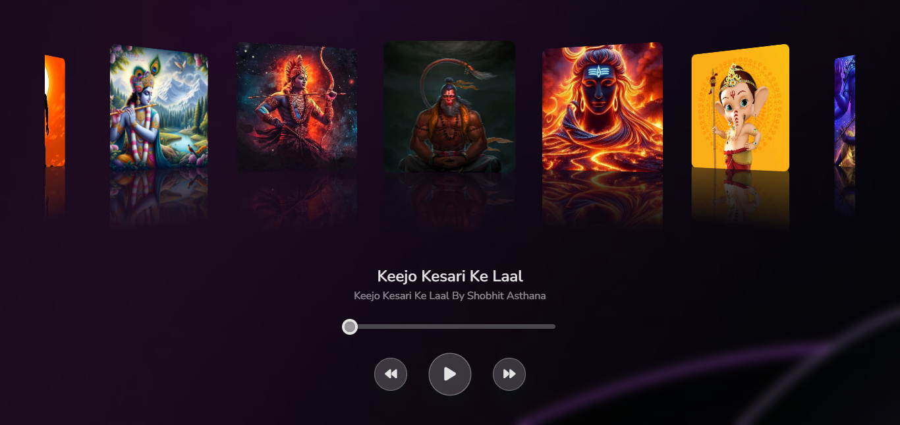

# Music Playlist With Slider

This Music Playlist With Slider is a web-based project built using HTML, CSS, and JavaScript. It allows users to create, manage, and play their favorite music tracks right from their browser.

## Features

- **Add Songs**: Easily add new songs to your playlist with title, artist, and album information.
- **Play/Pause**: Simple controls to play and pause your music.
- **Track Progress**: Visual progress bar to see how much of the song has played.
- **Responsive Design**: Looks great on both desktop and mobile devices.
- **Local Storage**: Save your playlist locally so that it's available even after refreshing the page.

## Technologies Used

- **HTML5**: Markup language for creating the structure of the application.
- **CSS3**: Styling the application with a modern and responsive design.
- **JavaScript**: Adding interactivity and dynamic functionality to the application.

## How to Use

1. Clone the repository: `git clone https://github.com/yourusername/music-playlist-app.git`
2. Open `index.html` in your preferred web browser.
3. Start adding your favorite songs to the playlist and enjoy!

## Screenshot

## Future Enhancements

- **Search Functionality**: Add the ability to search for songs within the playlist.
- **Drag and Drop**: Implement drag-and-drop functionality to reorder songs.
- **Audio Visualization**: Add visual effects that respond to the music being played.

## Contributing

Feel free to fork this repository and make changes. Pull requests are always welcome!

## License

This project is licensed under the MIT License.
